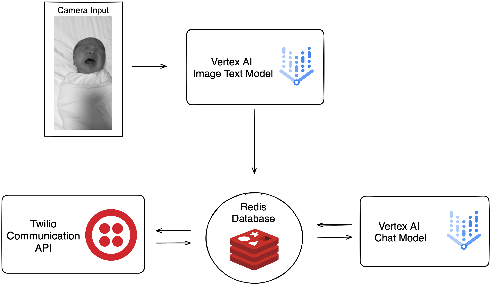

# Documentation

# Set-Up

## 🔧 Dependencies

```markdown
google-cloud-aiplatform==1.36.4
redis==5.0.1
twilio==8.10.2
```

### Vertex AI

Install the Vertex AI SDK for Python with this [link](https://cloud.google.com/vertex-ai/docs/start/install-sdk). Ensure that the Python version (Python 3.10 or 3.11 as of 11/19/23) for the virtual environment fits the python requirement for Vertex AI SDK. Then, set up the [Application Default Credentials](https://cloud.google.com/docs/authentication/provide-credentials-adc) for your Google Cloud Services. Finally, ensure to do `source ~/.bashrc` at the end. 

### Redis

Install Redis for Python with this [link](https://redis.io/docs/install/install-redis/) or using `pip install redis` . Please refer to the [Redis Documentation](https://redis.io/docs/) for more help.

### Twilio

Install and setup Twilio for Python using this [link](https://www.twilio.com/docs/twilio-cli/quickstart) or using `pip install twilio`.

## 📖 Implementation

### Diagram




### Redis Database

Create library to use in other files to create the same Redis instance

### Conversationer

Initiates conversation with Vertex AI and sends/receives messages from a Redis Database.

```jsx
Initializes Google API Platform
Initializes Redis Database
Initializes a Vertex AI ChatModel using a pre-trained model named "chat-bison"
Retrieves context and input message from the Redis database
Starts a chat with the Vertex AI model using the provided context
Sends the input message to the model and receives a response
Tries to establish a connection to another Redis database to verify connectivity.
Stores the model's response back into the Redis database for the user
```

### Image Question and Answer

Use Vertex AI image text model to answer a series of questions about baby’s situation.

```markdown
Initialize Google Cloud and Vertex AI Model
Load the input image 
Generate the answers given the series of questions 
Initialize the Redis database 
Formulate and publish the answers as the context for 
	the Conversationer 
```

### Twilio App

Contains SMS interactions with Parent

```markdown
Initializes Redis Database 
Create a Twilio Client 
Retrieve and publish the Parent's Message 
	for Conversationer
Retrieve Conversationer's Message and send to the Parent
```

## 🚀 Launch

1. Navigate to `first_demo` folder
2. Ensure that Google Application Default Credentials are set up 
3. Confirm that Twilio’s Account SID, Authentication Code, and Phone Numbers are correct
4. Learn the virtual environment that you have created with the main dependencies 
5. Execute `ngrok http 5000` and copy ngrok URL into Twilio Webhook
    1. ⚠️MacOS needs to turn off Airplay Receiver in Settings
6. Execute Twilio Flask App `twilio_app.py` 
7. Text to Your Designated Baby Face AI!

## 🔮 Future Implementations

Our vision extends to integrating long-term video monitoring devices like cameras or specialized baby monitoring devices. We aim to refine our AI model, providing more tailored solutions and fostering more engaging conversations to better serve parents and their babies.